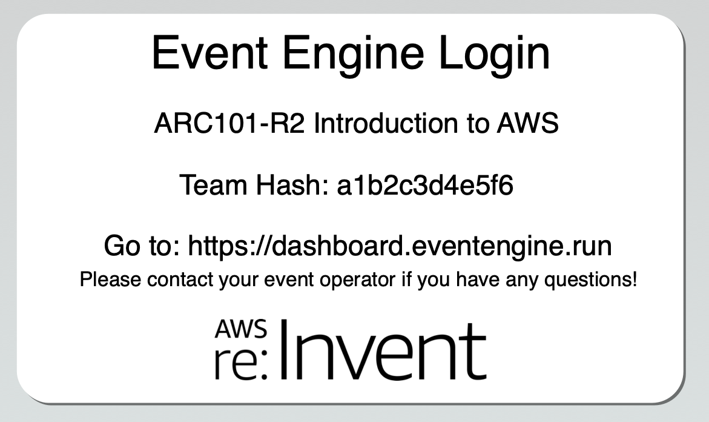
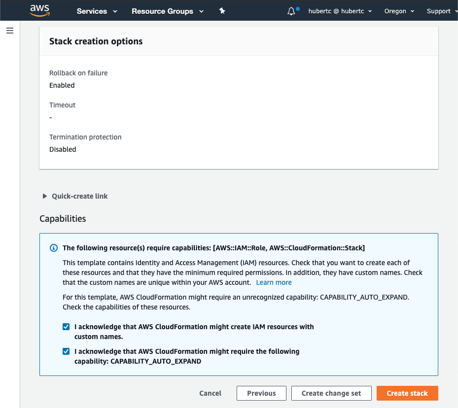
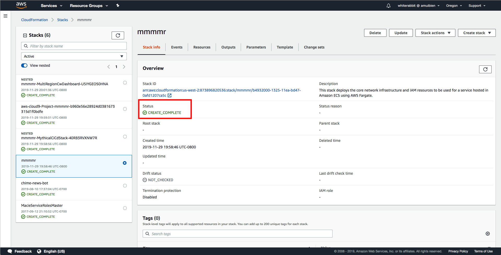
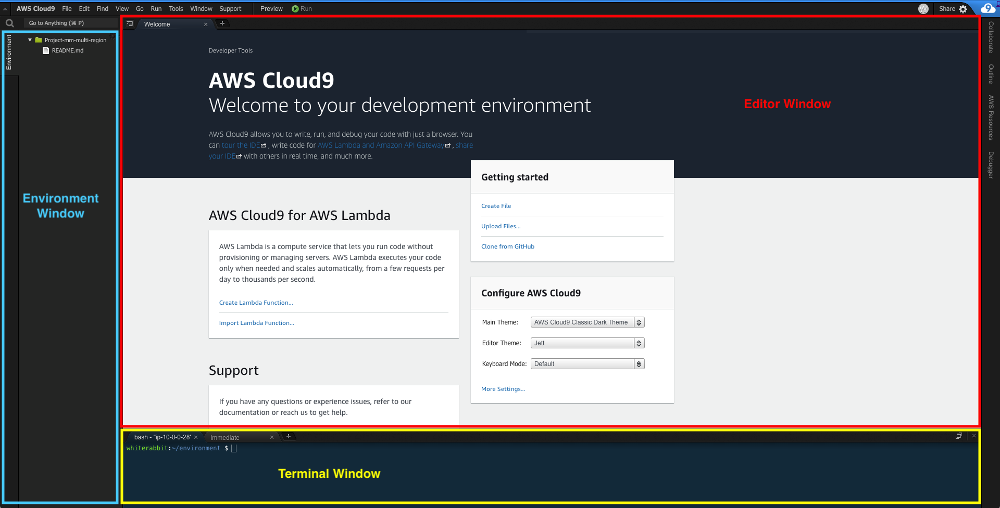

# Mythical Mysfits: Multi-Region-Workshop

## Workshop progress
**Lab 0: Workshop Initialization**

Lab 1: Instrument Observability

Lab 2: Operationalize Observability - Aggregate Metrics

Lab 3: Prep for Multi-Region Deployments

Lab 4: Implement Traffic Management

Lab 5: Load Test and Failover

## Lab 0 - Deploy Existing Mythical Stack

In this lab, you'll launch the core infrastructure for the workshop and get familiar with the Cloud9 integrated development environment (IDE) where you'll edit code and run commands.

## STOP! Pay attention here because it matters!

<b>Expand this section</b> if you are attending an AWS event where you are provided an AWS account to use.

You will be provided an AWS account through an platform called Event Engine. Workshop administrators will do a walk through, but here is a quick start if you prefer step by step instructions or arrived late.

**Quick Start:**

1. You should have a notecard that looks like the image below. If you do not have one, raise your hand and session support will get you one. -

    

2. Open a new browser tab and navigate to [https://dashboard.eventengine.run](https://dashboard.eventengine.run).

3. Enter the 12-digit team hash code found on the card and click **Accept Terms & Login**

4. Once logged in, you should see your event listed on the page. Click on **AWS Console**.

    

5. On the next page, click **Open AWS console** to launch the AWS management console. You will not need API key/secret for this workshop, but it's good to note down in case you want to use the CLI to do things like describe calls.

    

If you get stuck, raise your hand and session support will come help you. Otherwise, proceed to the next section to deploy the workshop environment.

If you're not attending an AWS event, you will need to use your own account. Make sure you have an IAM account with elevated permissions as noted earlier. Move on to the next section to deploy the workshop environment.

### [1] Deploy Mythical CloudFormation Stack

1. Log into the [AWS Management Console](https://console.aws.amazon.com/console/home)

2. Click on one of the **Deploy to AWS** icons below to load the stack in the corresponding region you'd like to use. **Protip:** Use right-click and open in a new tab, so you can refer back to these instructions.

    Region | Launch Template
    ------------ | -------------  
    **Oregon** (us-west-2) | 

    The link will load the AWS CloudFormation console in the selected region and populate the Amazon S3 URL with the location of the core workshop CloudFormation template. If you want to review the core and nested templates, you can find them in the cfn folder of the GitHub repo.

    

3. Click **Next**

4. On the "Specify stack details" page, *optionally* enter a unique stack name. This is helpful if you're sharing an account with others and need to make your stack unique.

    **Note:** Keep the stack name under 8 characters. The stack name is appended to predefined resource names so you can easily identify stuff created for this workshop. Some AWS resources have a character limit for its name, so by keeping the stack name short, it avoids running into this issue.

5. Click **Next**, and **Next** again on the "Configure stack options" page since no additional changes are needed.

6. On the "Review" page, take a look at all the parameters and make sure they're accurate. Check the boxes next to **I acknowledge that AWS CloudFormation might create IAM resources with custom names.** AND **I acknowledge that AWS CloudFormation might require the following capability: CAPABILITY_AUTO_EXPAND**. If you do not check these boxes, the stack creation will fail.

    

    

    
Learn more: What are these boxes?

    The first box authorizes the creation of IAM roles. The second box indicates there are nested CloudFormation stacks.

    In both cases, the resources will be cleaned up if you delete the stack during workshop cleanup.

    Further reading: [CloudFormation acknowledgements](https://docs.aws.amazon.com/AWSCloudFormation/latest/APIReference/API_CreateStack.html)

    

7. Click **Create** to launch the CloudFormation stack.

    The CloudFormation stack will take a few minutes to launch. You can check on the stack creation process in the CloudFormation Dashboard. Your stack should show status **CREATE\_COMPLETE** in roughly 5-10 minutes. If you select box next to your stack and click on the **Events** tab, you can see what steps it's on.

    

    If there was an [error](http://docs.aws.amazon.com/AWSCloudFormation/latest/UserGuide/troubleshooting.html#troubleshooting-errors) during the stack creation process, CloudFormation will rollback and terminate. You can investigate and troubleshoot by looking in the Events tab. Any errors encountered during stack creation will appear in the event stream as a failure.

    Move on to the next section while the stack creation is in progress.

### [2] Familiarize yourself with the workshop environment and tips

The CloudFormation template will launch the following:

* VPC with public subnets, routes and Internet Gateway
* An ECS cluster with no EC2 resources because we're using Fargate
* ECR repositories for your container images
* Application Load Balancer to front all your services
* Cloud9 development environment
* Code deployment infrastructure (CodeCommit, CodeBuild, CodePipeline)
* DynamoDB table to store mysfits data

#### Workshop tips

These tips will help you be more efficient and save time.

* If you have a tablet with you, use that for the workshop instructions while you work on your laptop.
* "Right-click, Open Link in New Tab" is your friend - throughout the workshop you'll be navigating to various service dashboards in the AWS management console and referring back to lab instructions. Using multiple browser tabs will save you time.
* Open a text editor to copy/paste resource names or keep a tab open with the CloudFormation outputs. For example, to load the Mythical Mysfits application, you'll browse to the load balancer DNS name. This value is good to have easily accessible to save you time since you'll be loading the app throughout the workshop.

### [3] Bootstrap the workshop environment

By now your Cloud9 IDE should have been created and accessible. In this section, you'll explore the Cloud9 interface if you're new to the IDE, and run the bootstrap script once the CloudFormation template has completed launching.

#### a. Access your AWS Cloud9 Development Environment

1. Navigate to the [Cloud9 Dashboard](https://console.aws.amazon.com/cloud9/home) and find your environment which will begin with `Project-` followed by the name of your the CloudFormation stack.

2. Click **Open IDE**.

    

#### b. Familiarize yourself with the Cloud9 interface

Once your Cloud9 IDE loads, you'll see an interface similar to this:

The environment window (BLUE) displays any files that are downloaded to your environment; essentially a directory tree.

The editor window (RED) is a file editor that will initially display a Welcome message. If you open any files from the environment windows directory tree, the file will open in the editor in a new tab. Test this out by double clicking on README.md in the left pane and edit the file by adding some arbitrary text. Then save it by clicking **File** and **Save**. Keyboard shortcuts will work as well. You can close file tabs by clicking on the **X**.

The terminal window (YELLOW) has a "bash" shell tab which is where you will run commands throughout the workshop. If you hover your mouse between the editor and terminal windows, you'll see it's possible to change the sizes of the windows. Use this opportunity to drag the terminal window up to give you more room to run commands and see outputs.

Learn more: Cloud9 and customizing the interface

Further reading:

* [Tour the IDE](https://docs.aws.amazon.com/cloud9/latest/user-guide/tour-ide.html)
* [Customizing the IDE](https://docs.aws.amazon.com/cloud9/latest/user-guide/ide.html)

#### c. Clone the workshop GitHub repo

There are a bunch of scripts that bootstrap the workshop environment. Clone the workshop respository to pull the files down locally to your Cloud9 IDE:

<pre>
$ git clone https://github.com/aws-samples/aws-multi-region-bc-dr-workshop.git
</pre>

#### d. Run the setup script to bootstrap the workshop environment

### IMPORTANT: Make sure the CloudFormation template has finished launching. The status of the workshop stack should show CREATE_COMPLETE before running this script; otherwise, the script will fail

The setup script will perform actions like install dependencies, perform an initial commit to the CI/CD pipeline, among other things. If you'd like to review what's happening, have a look at the scripts in the bootstrap folder in the GitHub repo.

Run the following commands to run the setup script.

<pre>
$ cd ~/environment/aws-multi-region-bc-dr-workshop
$ bootstrap/setup
</pre>

The script takes less than a minute to run. When you see **"Profile associated successfully. Script completed. Please continue on with Lab-1!"**, that means bootstrap has completed.

# Checkpoint

You now have an operational workshop environment to work with. [Proceed to Lab 1](../lab-1-xray)
