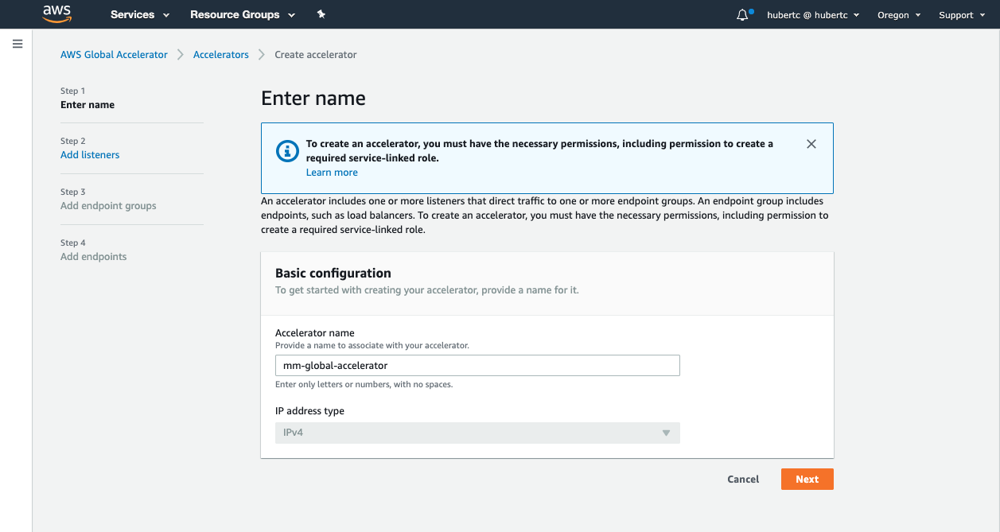
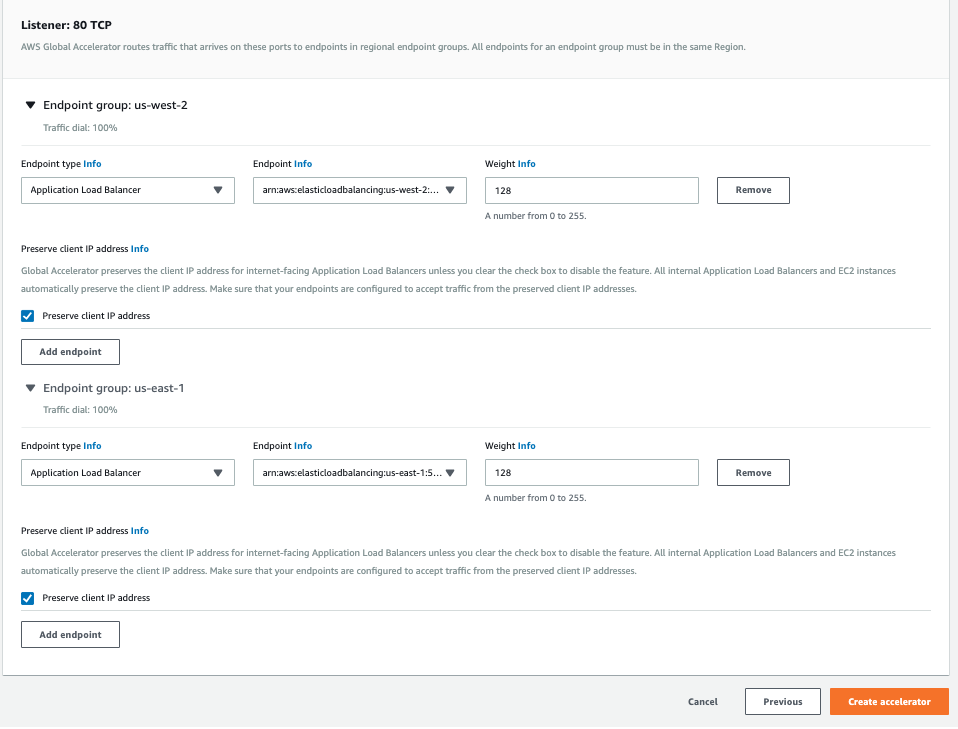
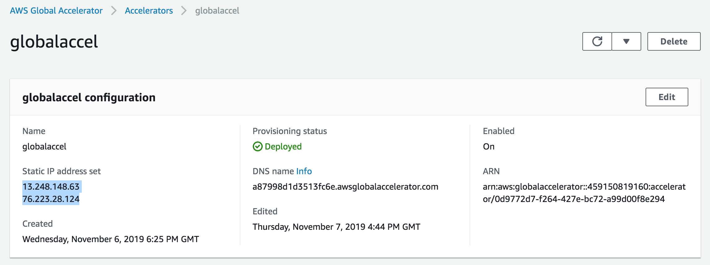

# Mythical Mysfits: Multi-Region-Workshop

## Workshop progress
✅ [Lab 0: Workshop Initialization](../lab-0-init)

✅ [Lab 1: Instrument Observability - Distributed Tracing with AWS X-Ray](../lab-1-xray)

✅ [Lab 2: Operationalize Observability - Aggregate Metrics](../lab-2-agg)

✅ [Lab 3: Preparing for Multi-Region Deployments](../lab-3-mr-prep)

**Lab 4: Implement Traffic Management - Global Accelerator**

[Lab 5: Load Test and Failover your multi-region application](../lab-5-loadtest)

## Lab 4 - Implement Traffic Management - Global Accelerator

AWS Global Accelerator is a network layer service that directs traffic to optimal regional endpoints based on health, client location, and policies that you configure. It provides you with static IP addresses that you associate with your accelerator which will act as a fixed entry point to your application endpoints in one or more AWS Regions.

Global Accelerator uses the AWS global network to optimize the network path from your users to your applications, improving performance. It also monitors the health of your application endpoints and reacts instantly to changes in health or configuration. It will redirect user traffic to healthy endpoints that deliver the best performance and availability to your users.

In this lab, you will use AWS Global Accelerator to route traffic to the Application Load Balancers in your primary and secondary region.

Here's a reference architecture for what you'll be building:

Here's what you'll be doing:
* Create an Accelerator
* Add Listeners
* Add Endpoint Groups
* Add Endpoints
* Test your Accelerator

### 4.1 Create an Accelerator

* Open the [Global Accelerator](https://us-west-2.console.aws.amazon.com/ec2/v2/home?region=us-west-2#GlobalAcceleratorDashboard:) console.
* Choose **Create accelerator**.
* Provide a name for your accelerator.
* Choose **Next**.

### 4.2 Add Listeners

With AWS Global Accelerator, you add listeners that process inbound connections from clients based on the ports and protocols that you specify. At the **Add Listeners** step, do the following:

* **Ports**: Enter 80.
* **Protocol**: Choose TCP.
* **Client affinity**: Leave as None.
* Choose **Next**.

### 4.3 Add Endpoint Groups

An endpoint group routes requests to one or more registered endpoints in AWS Global Accelerator. When you add a listener, you specify the endpoint groups for Global Accelerator to direct traffic to. An endpoint group, and all the endpoints in it, must be in one AWS Region. You can add different endpoint groups for different purposes, for example, for blue/green deployment testing.

Global Accelerator directs traffic to endpoint groups based on the location of the client and the health of the endpoint group. You can also set the percentage of traffic to send to an endpoint group. You do that by using the traffic dial to increase (dial up) or decrease (dial down) traffic to the group. The percentage is applied only to the traffic that Global Accelerator is already directing to the endpoint group, not all traffic coming to a listener.

At the **Add endpoint groups** step, do the following:

* **Region**: Choose the primary region that you deployed the application in.
* **Traffic dial**: Leave as 100.
* Choose **Add endpoint group**.
* **Region**: Choose the secondary region that you deployed the application in.
* **Traffic dial**: Leave as 100.
* Choose **Next**.

### 4.4 Add Endpoints

Endpoints in AWS Global Accelerator can be Network Load Balancers, Application Load Balancers, EC2 instances, or Elastic IP addresses. A static IP address serves as a single point of contact for clients, and Global Accelerator then distributes incoming traffic across healthy endpoints. Global Accelerator directs traffic to endpoints by using the port (or port range) that you specify for the listener that the endpoint group for the endpoint belongs to.

Each endpoint group can have multiple endpoints. You can add each endpoint to multiple endpoint groups, but the endpoint groups must be associated with different listeners.

The endpoints we’ll be using are the Application Load Balancers in the primary and secondary region. At the **Add endpoints** step, do the following:

* Under the primary region endpoint group, choose **Add endpoint**.
* **Endpoint type**: Choose Application Load Balancer.
* **Endpoint**: Choose the load balancer associated with this application.
* Under the secondary region endpoint group, choose **Add endpoint**.
* **Endpoint type**: Choose Application Load Balancer.
* **Endpoint**: Choose the load balancer associated with this application.
* Choose **Create accelerator**.

### 4.5 Test your Accelerator

Before testing your accelerator, wait for the Status of your Accelerator to go from In progress to **Deployed**. Once it’s deployed, click on the name of your Accelerator. Check that the Status of the Listener is **All healthy**. Drill down to your endpoints and check that their Health status is **Healthy**. Now that your accelerator is deployed and your listener and endpoints are healthy, go back to your accelerator and copy one of the IP addresses. You can find the IP addresses in the configuration panel under **Static IP address set**. Test the static IP address in your browser. You should see the your Mythical Mysfits!

# Checkpoint

Congratulations!!! You've successfully created an accelerator to route traffic to both your primary and secondary region.

Proceed to [Lab 5](../lab-5-loadtest)!
